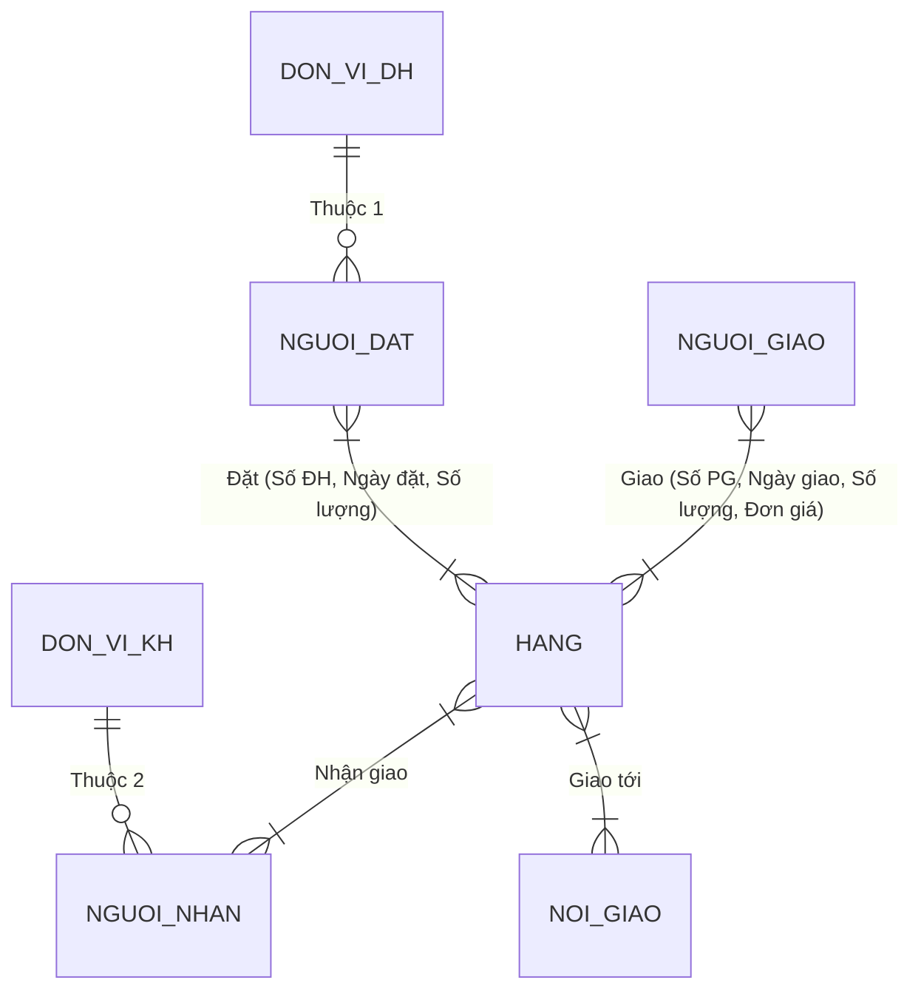
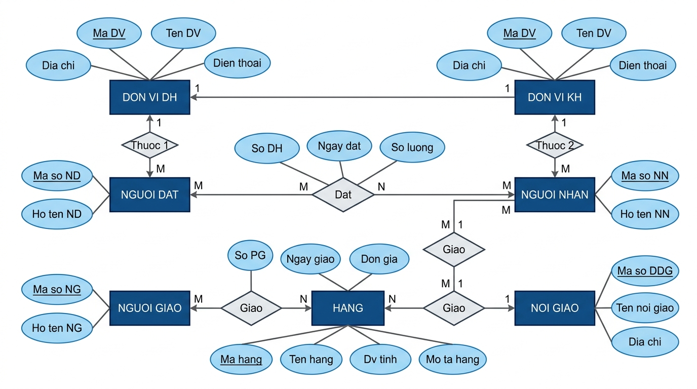
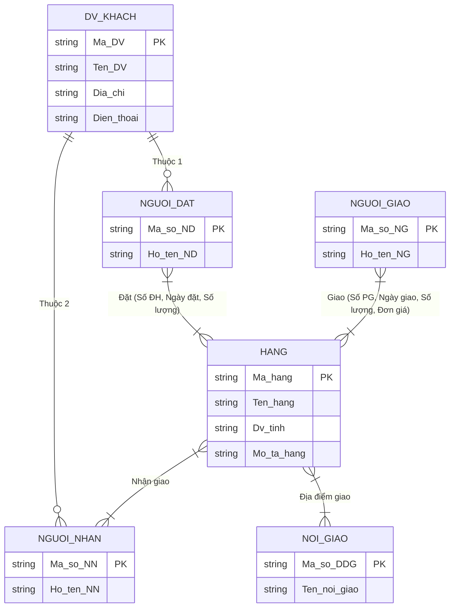
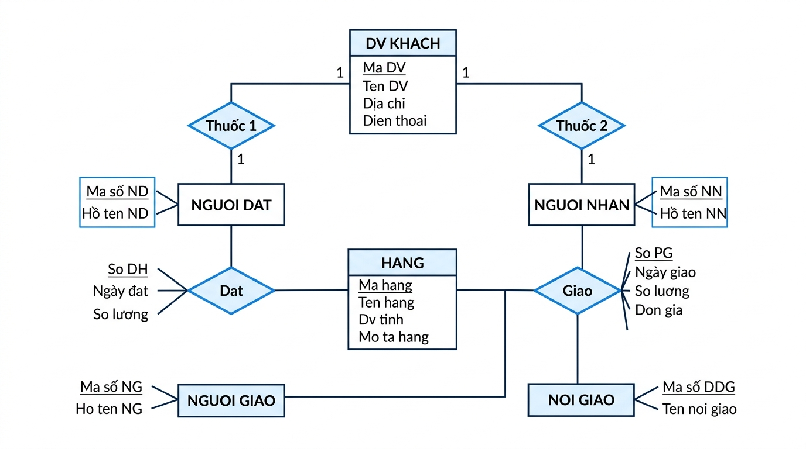

# BÀI TẬP: XÂY DỰNG MÔ HÌNH ERD QUẢN LÝ ĐƠN ĐẶT HÀNG & PHIẾU GIAO HÀNG

**Mục tiêu:** Thiết kế biểu đồ mô hình thực thể mối quan hệ (ERD - Entity Relationship Diagram) cho cơ sở dữ liệu quản lý Đơn đặt hàng và Phiếu giao hàng từ yêu cầu bài toán.

---

## BƯỚC 1: LIỆT KÊ VÀ CHỌN LỌC THÔNG TIN

Từ hai mẫu chứng từ ban đầu, ta trích xuất các trường thông tin chính như sau:

### 1. Đơn đặt hàng:
- **Số đơn hàng** (Số ĐH)
- **Tên đơn vị đặt hàng** (Tên ĐV)
- **Địa chỉ**
- **Điện thoại**
- **Ngày đặt**
- **Tên hàng**
- **Mô tả hàng**
- **Đơn vị tính** (Đv tính)
- **Số lượng**
- **Người đặt hàng** (Họ tên NĐ)

### 2. Phiếu giao hàng:
- **Số phiếu giao hàng** (Số PG)
- **Tên đơn vị khách hàng** (Tên ĐV)
- **Địa chỉ**
- **Nơi giao hàng** (Tên nơi GH)
- **Ngày giao**
- **Tên hàng**
- **Đơn vị tính** (Đv tính)
- **Số lượng**
- **Đơn giá**
- **Thành tiền**
- **Tên người nhận** (Họ tên NN)
- **Tên người giao** (Họ tên NG)

---

## BƯỚC 2: XÁC ĐỊNH THỰC THỂ VÀ THUỘC TÍNH

Dựa vào danh sách thông tin đã lọc, ta xác định 7 thực thể chính và các thuộc tính tương ứng:

| STT | Thực thể | Thuộc tính chính (PK: Khóa chính) | Thuộc tính khác |
|:---:|:---|:---|:---|
| 1 | **ĐƠN VỊ ĐH** | `Mã ĐV` | Tên ĐV, Địa chỉ, Điện thoại |
| 2 | **ĐƠN VỊ KH** | `Mã ĐV` | Tên ĐV, Địa chỉ |
| 3 | **HÀNG** | `Mã hàng` | Tên hàng, Đv tính, Mô tả hàng |
| 4 | **NGƯỜI ĐẶT** | `Mã số NĐ` | Họ tên NĐ |
| 5 | **NƠI GIAO** | `Mã số ĐĐG` | Tên nơi giao |
| 6 | **NGƯỜI NHẬN** | `Mã số NN` | Họ tên NN |
| 7 | **NGƯỜI GIAO** | `Mã số NG` | Họ tên NG |

---

## BƯỚC 3: XÁC ĐỊNH MỐI QUAN HỆ

### 1. Bảng phân tích hành động (Động từ Đặt và Giao):

#### A. Động từ "Đặt":
- **Ai đặt?** $\rightarrow$ Thực thể **NGƯỜI ĐẶT**
- **Đặt cái gì?** $\rightarrow$ Thực thể **HÀNG**
- **Sử dụng gì để đặt?** $\rightarrow$ Thuộc tính `Số ĐH`
- **Đặt khi nào?** $\rightarrow$ Thuộc tính `Ngày đặt`
- **Đặt bao nhiêu?** $\rightarrow$ Thuộc tính `Số lượng`

#### B. Động từ "Giao":
- **Ai giao?** $\rightarrow$ Thực thể **NGƯỜI GIAO**
- **Giao cái gì?** $\rightarrow$ Thực thể **HÀNG**
- **Giao ở đâu?** $\rightarrow$ Thực thể **NƠI GIAO**
- **Giao cho ai?** $\rightarrow$ Thực thể **NGƯỜI NHẬN**
- **Sử dụng gì để giao?** $\rightarrow$ Thuộc tính `Số PG`
- **Giao khi nào?** $\rightarrow$ Thuộc tính `Ngày giao`
- **Giao bao nhiêu?** $\rightarrow$ Thuộc tính `Số lượng`
- **Giá trị giao bao nhiêu?** $\rightarrow$ Thuộc tính `Đơn giá`, `Thành tiền`

### 2. Quan hệ sở hữu / thuộc về (Thuộc):
- **Thuộc 1**: `NGƯỜI ĐẶT` **THUỘC** `ĐƠN VỊ ĐH` (Một Đơn vị ĐH có thể có nhiều Người đặt hàng).
- **Thuộc 2**: `NGƯỜI NHẬN` **THUỘC** `ĐƠN VỊ KH` (Một Đơn vị KH có thể có nhiều Người nhận hàng).

---

## BƯỚC 4: VẼ BIỂU ĐỒ MÔ HÌNH ERD (BAN ĐẦU)

Mô hình ERD chưa chuẩn hóa bao gồm đầy đủ 7 thực thể và các mối quan hệ:





---

## BƯỚC 5: CHUẨN HÓA VÀ RÚT GỌN MÔ HÌNH ERD

### Rút gọn thực thể:
Do **Đơn vị đặt hàng** (`ĐƠN VỊ ĐH`) và **Đơn vị khách hàng** (`ĐƠN VỊ KH`) đều đại diện cho các tổ chức/đơn vị bên ngoài tiến hành giao dịch với cửa hàng, ta gộp hai thực thể này thành **một thực thể duy nhất**:
$$\text{ĐV KHÁCH} (\underline{\text{Mã ĐV}}, \text{Tên ĐV}, \text{Địa chỉ}, \text{Điện thoại})$$

### Biểu đồ ERD sau khi gộp và chuẩn hóa:





---

## HƯỚNG DẪN ĐẨY BÀI NỘP LÊN GITHUB

Để đẩy bài làm này lên repository GitHub của bạn (`https://github.com/dtc245200988-byte/BAI_TAP.git`), chạy các lệnh Git sau trong terminal:

```bash
# 1. Khởi tạo Git repository (nếu chưa khởi tạo)
git init

# 2. Thêm remote repository của bạn
git remote add origin https://github.com/dtc245200988-byte/BAI_TAP.git

# 3. Thêm tất cả các file bài làm vào staging
git add .

# 4. Tạo commit ghi nhận kết quả
git commit -m "Hoàn thành bài tập thiết kế mô hình ERD quản lý đơn đặt hàng và phiếu giao hàng"

# 5. Đẩy dữ liệu lên GitHub (nhánh main hoặc master)
git branch -M main
git push -u origin main
```
